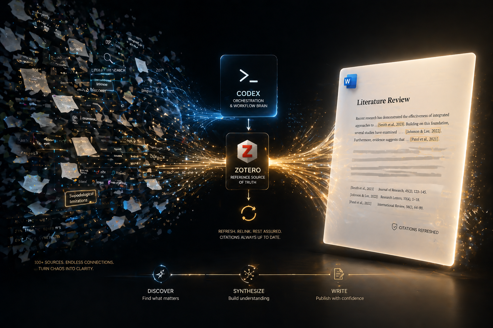
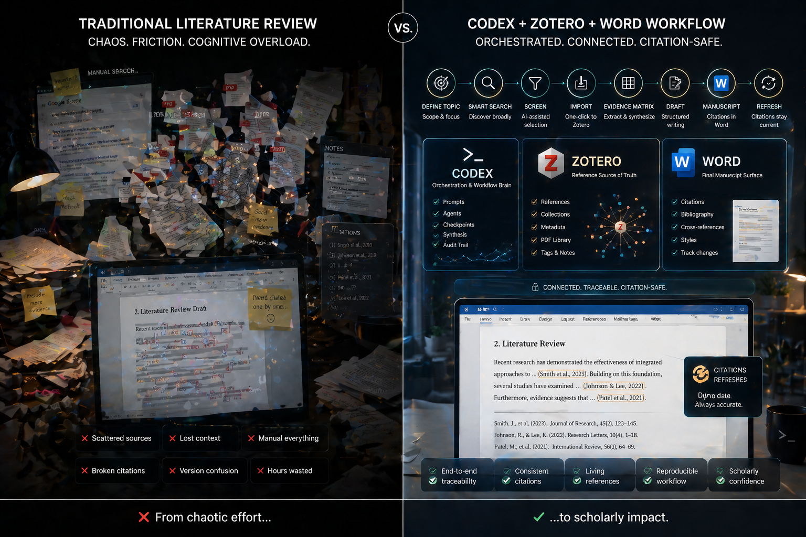
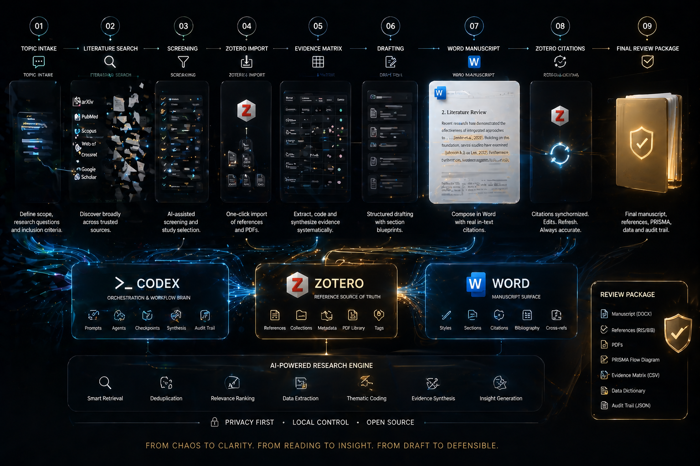
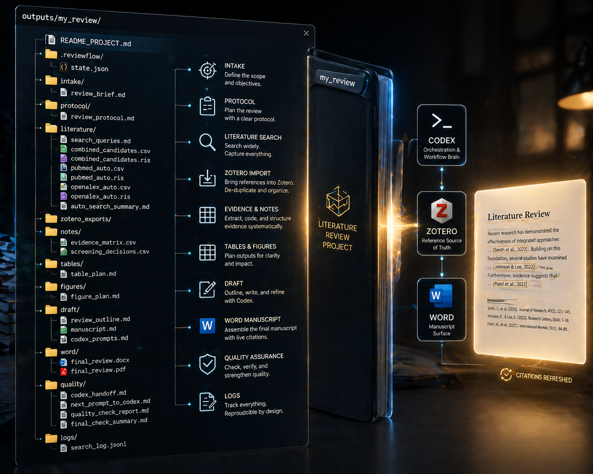

<div align="center">

# CORA

### Codex Literature Review Automation with Zotero-backed references and Word-ready citations.

[](https://github.com/KobeBryant0127/zotero-codex-review-workflow/actions/workflows/ci.yml)
[](LICENSE)
[](README.md)
[](README.md)
[](README.md)
[](README.md)
[](README.md)

<p>
  <a href="README.zh-CN.md">中文</a> •
  <a href="#why-cora">Why</a> •
  <a href="#use-cora-in-codex">Use in Codex</a> •
  <a href="#workflow">Workflow</a> •
  <a href="#output">Output</a> •
  <a href="#docs">Docs</a>
</p>

</div>

> **CORA** is a literature-review workflow engine underneath and a Codex-managed experience on top.  
> You describe the review. Codex runs the workflow. Zotero keeps the references real. Word ships the final manuscript.

<p align="center">
  
</p>

## Latest

- Codex-first kickoff prompt built into the README
- Stateful handoff and resume workflow
- Zotero-backed RIS export plus Word citation audit
- Visual README with workflow, comparison, and project structure graphics

<a id="why-cora"></a>

## Why CORA

Writing a literature review usually means juggling search, screening, notes, drafting, Zotero, and Word by hand. CORA compresses that into one tracked pipeline:

- **Codex** orchestrates the next step
- **Zotero** stays the reference source of truth
- **Word** remains the final citation-safe delivery surface

<table>
  <tr>
    <td width="25%" align="center"><strong>🧠 Managed by Codex</strong><br>Prompts, handoffs, checkpoints, and resume points stay explicit.</td>
    <td width="25%" align="center"><strong>📚 Anchored in Zotero</strong><br>References, metadata, PDFs, and collections stay grounded.</td>
    <td width="25%" align="center"><strong>📝 Delivered in Word</strong><br>Final manuscripts keep real in-text citations and bibliography fields.</td>
    <td width="25%" align="center"><strong>📦 Packaged for review</strong><br>Evidence matrix, RIS exports, draft assets, and audit trail stay together.</td>
  </tr>
</table>

<a id="use-cora-in-codex"></a>

## Use CORA in Codex

Most users should not be thinking about the CLI first. The intended experience is:

1. Open this repo in Codex
2. Paste the prompt below
3. Let Codex run everything it can
4. Only step in when Codex asks for a real human action

```text
I want you to fully manage a literature review project for me using this repository.
My topic is: [TOPIC]
My review type is: [TYPE]
My language is: [LANGUAGE]
My goal is: [GOAL]
Please handle everything you can, and only stop when you truly need me to do a manual step such as Zotero import, PDF verification, or Word citation insertion.
When you stop, tell me exactly what to do and exactly what to reply with.
```

### Under the hood

The pipeline is real:

- intake
- literature search
- RIS export
- Zotero import
- evidence matrix
- drafting
- Word manuscript
- Zotero citation refresh
- final audit

You usually do not need to drive those steps manually.

<a id="workflow"></a>

## Workflow

<p align="center">
  
</p>

<p align="center">
  
</p>

### What CORA already does

- Creates a stateful review project for a new topic
- Searches PubMed and OpenAlex and exports CSV plus RIS
- Merges candidates into one tracked pool
- Generates handoff files and next prompts for Codex
- Audits final Word documents for Zotero-style fields
- Produces a final readiness summary for the package

### What CORA does not fake

- It does not claim automatic academic correctness
- It does not replace human judgment on scope or conclusions
- It does not pretend placeholder citations are real Zotero Word fields
- It does not bypass access restrictions

<a id="output"></a>

## Output

<p align="center">
  
</p>

Key final artifacts:

- `word/final_review.docx`
- `word/final_review.pdf`
- `notes/evidence_matrix.csv`
- `literature/combined_candidates.ris`
- `quality/final_check_summary.md`

## Quick CLI

If you want the underlying commands:

```powershell
py scripts\reviewflow.py check
py scripts\reviewflow.py intake --name my_review --topic "your literature review topic" --output .\outputs
py scripts\reviewflow.py run --project .\outputs\my_review
py scripts\reviewflow.py handoff --project .\outputs\my_review
py scripts\reviewflow.py resume --project .\outputs\my_review --mark zotero_imported
py scripts\reviewflow.py final-check --project .\outputs\my_review --docx .\outputs\my_review\word\final_review.docx
```

<a id="docs"></a>

## Docs

- [README.zh-CN.md](README.zh-CN.md)
- [QUICKSTART.md](QUICKSTART.md)
- [docs/00_portable_project_design.md](docs/00_portable_project_design.md)
- [docs/08_word_zotero_citation_workflow.md](docs/08_word_zotero_citation_workflow.md)
- [docs/11_launch_playbook.md](docs/11_launch_playbook.md)
- [ROADMAP.md](ROADMAP.md)

## Positioning

- **CORA**: Codex Literature Review Automation
- **Promise**: Codex-managed literature review writing with Zotero-backed references and Word-ready citations
- **Reality**: a workflow engine underneath, a hands-free Codex experience on top

## License

MIT. See [LICENSE](LICENSE).
